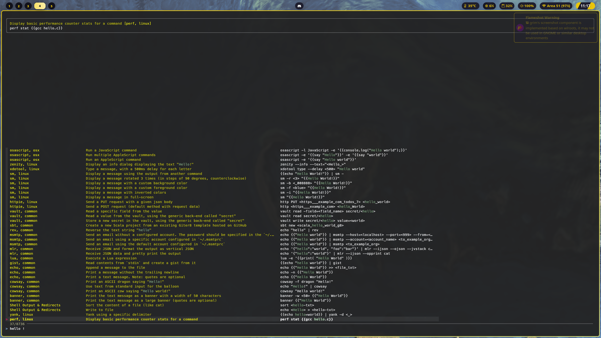

<h1 align="center">Dotfiles</h1>
<p align="center">This is the repository for storing and sharing my dotfiles and useful workflow tools.<p>
<p align="center">Disclaimer : this is heavily inspired from excellent flick0's <a href="https://github.com/flick0/dotfiles/tree/aurora">aurora dotfiles</a>.<p>
<div align="center">
    
    
</div>



> Using the excellent `navi`

## Dependencies

As this setup is made for hyprland, a bleeding-edge distribution is recommended (e.g: arch, endeavouros, ...).

```bash
# General dependencies
$ yay -S neofetch bat btop fish dunst waybar hyprland-git hyprpaper xdg-desktop-portal-hyprland-git polkit-kde-agent navi zoxide swaylock thunar flameshot-git cliphist nwg-bar avizo pamixer light

# Oh-my-fish
$ curl https://raw.githubusercontent.com/oh-my-fish/oh-my-fish/master/bin/install | fish
$ omf install https://github.com/decors/fish-colored-man
$ omf install https://github.com/jorgebucaran/autopair.fish
$ omf install https://github.com/gazorby/fish-abbreviation-tips
$ omf install https://github.com/acomagu/fish-async-prompt
$ omf install https://github.com/franciscolourenco/done
$ omf install sudope

# aichat
$ cargo install --force aichat

# anyrun
$ git clone https://github.com/Kirottu/anyrun.git # Clone the repository
$ cd anyrun # Change the active directory to it
$ cargo build --release # Build all the packages
$ cargo install --path anyrun/ # Install the anyrun binary
$ mkdir -p ~/.config/anyrun/plugins # Create the config directory and the plugins subdirectory
$ cp target/release/*.so ~/.config/anyrun/plugins # Copy all of the built plugins to the correct directory
$ cp examples/config.ron ~/.config/anyrun/config.ron # Copy the default config file

# nwg-bar icon
$ sudo cp <dotfiles>/manual/sleep-light.svg /usr/share/nwg-bar/images/system-sleep.svg
```

# Note

* As I am french, some keybinds won't work for you in `~/.config/hypr/hyprland.conf`. Think of that 😉
