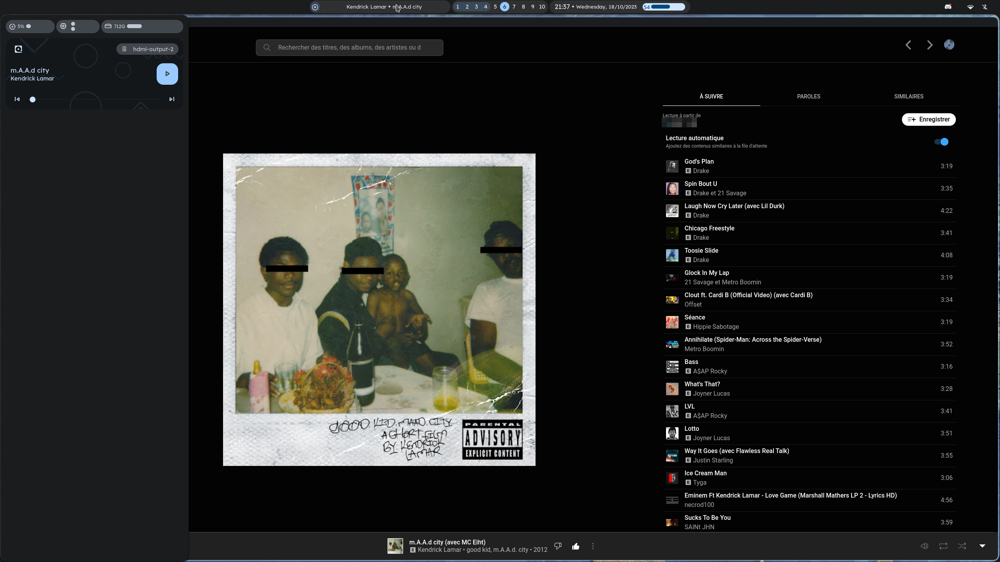

<h1 align="center">Dotfiles</h1>
<p align="center">This is the repository for storing and sharing my dotfiles and useful workflow tools.<p>
<p align="center">Disclaimer : this is heavily inspired from excellent end4's <a href="https://github.com/end-4/dots-hyprland/tree/m3ww">m3ww dotfiles</a>.<p>
<div align="center">
    
    
</div>





## Dependencies

As this setup is made for hyprland, a bleeding-edge distribution is recommended (e.g: arch, endeavouros, ...).

```bash
# General dependencies
$ yay -S eww-tray-wayland-git cava hyprland-git xdg-desktop-portal-hyprland-git polkit-kde-agent swayidle fzf gawk thunar gtklock gtklock-playerctl-module gtklock-powerbar-module gtklock-userinfo-module gojq geticons lexend-fonts-git python-pywal python-desktop-entry-lib python-poetry python-build python-pillow swww ttf-material-symbols-git wlogout python-material-color-utilities libqalculate anyrun yad bc blueberry bluez boost boost-libs findutils fuzzel coreutils networkmanager network-manager-applet nlohmann-json gnome-control-center gnome-keyring procps pavucontrol playerctl util-linux

# Utilities
$ yay -S neofetch bat ripgrep fd btop fish pamixer light navi zoxide cliphist flameshot-git plasma-browser-integration starship upower

# Oh-my-fish
$ curl https://raw.githubusercontent.com/oh-my-fish/oh-my-fish/master/bin/install | fish
$ omf install https://github.com/decors/fish-colored-man
$ omf install https://github.com/jorgebucaran/autopair.fish
$ omf install https://github.com/gazorby/fish-abbreviation-tips
$ omf install https://github.com/acomagu/fish-async-prompt
$ omf install https://github.com/franciscolourenco/done
$ omf install sudope
```

# Note

* As I am french, some keybinds won't work for you in `~/.config/hypr/hyprland.conf`. Think of that 😉
